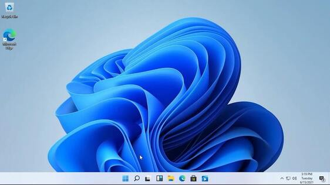

# Windows 11

### Windows 11 is the latest and greatest operating system from Microsoft for desktops and tablets . It is the successor of Windows 10. Windows 11 receives feature and security updates frequently for users at no cost . The operating system includes improved support for biometric authentication through the Windows Hello platform. Devices with supported cameras (requiring infrared illumination, such as Intel RealSense) allow users to log in with iris or face recognition, similarly to Kinect.

### ​One of the main Differences between Windows 10 and Windows 11 is the new start menu. It’s Simple, elegant, And way more optimized for Touch users while also being friendly to traditional desktop users. Another Main feature is that the taskbar icons are now centered by Default !

### Windows 11 also introduces a new feature called Snap Layouts which enhances multitasking by allowing users to organize their windows into perfect grids. This feature is especially useful for users with large or multiple monitors, as it allows them to efficiently manage multiple applications simultaneously. With Snap Layouts, users can choose from a variety of predefined layouts to arrange their windows, or they can create custom configurations to suit their specific needs. This enhancement not only boosts productivity but also provides a more organized and visually appealing desktop environment.

### Another significant enhancement in Windows 11 is the revamped Microsoft Store, which now offers a wider range of apps and a more streamlined user experience. The new store has been redesigned to be more user-friendly and includes a greater variety of content, including Android apps through Amazon’s Appstore integration. This allows users to run mobile apps natively on their desktop, bridging the gap between mobile and PC software.

### Windows 11 also focuses on enhancing the touch experience, making it more intuitive and smoother for tablet users. The touch targets are larger, making it easier to interact with the OS using touch gestures. Moreover, there are new gestures integrated that mimic the trackpad gestures, providing a more cohesive experience across devices. This focus on touch improvements makes Windows 11 a versatile choice for both traditional and modern form factors.

### For developers, Windows 11 introduces improved tools and APIs to foster a more robust app development environment. The new App SDK aims to simplify the process of developing and updating apps across both Windows 10 and Windows 11. This ensures that applications can take full advantage of the latest features in Windows 11 without sacrificing compatibility with older versions, thereby supporting a broader user base.

### Additionally in Version 23H2, Microsoft Incorporated a plethora of AI Features one of them being Microsoft Copilot, which is a personal assistant that can help you with your day to day tasks. It can also help you with your programming tasks. It's based on GPT-4 (recent versions using GPT-4O) which is a Large Language Model developed and maintained by OpenAI. The added integration with the OS and the 1st party Microsoft Apps ensures stretches the Limits of the LLM and ensures a rich overall user experiece

### Windows 11 provides heavier integration with the Xbox ecosystem. The Xbox App has been integrated into the Operating System itself (Although it can be Uninstalled). This allows you to Download and play any Xbox or pc games right from the Xbox App. Speaking of Gaming, one of the Highlights of Windows 11 is support for Auto HDR and Microsoft Direct Storage. Auto HDR (as the name suggests) can automatically enable HDR on games that traditionally don’t support it thereby making the Game look much better. On the other hand, Microsoft Direct storage is a revolutionary Feature. It is a storage API that aims to reduce game load times and texture pop-in by eliminating data streaming overhead. This feature promises to help load games instantly on a PC and free up CPU resources.

### Another field where Windows 11 focuses on and which also the reason why it's system requirements are so high is security. Windows 11 takes PC Security Way too seriously. It has improved Windows Defender and now requires a TPM 2.0 Hardware Module Chip which is basically used to store data that can be used for authentication. If your PC happenes to not have one of these modules then it's officially not supported by Windows 11 but as usual the People of the internet have found several ways to install WIndows 11 without the presence of the TPM chip ! 

